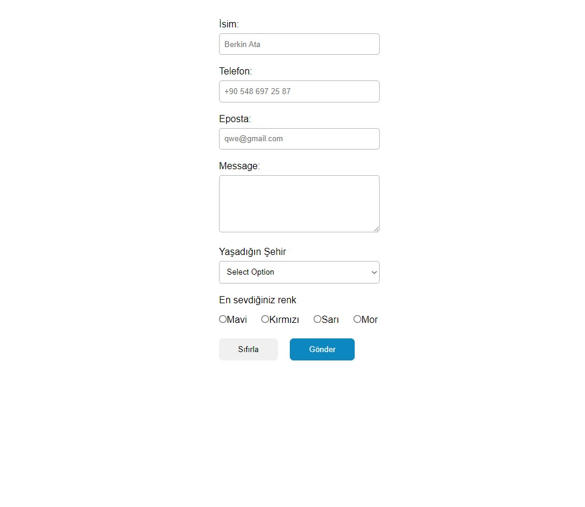

# Simple first form

This project is a first simple form design web project page. The project was developed using HTML and CSS and published using GitHub.

Contents

- [Project URL](#project-urls)
- [Features](#features)
- [Project Content](#project-content)
- [Screenshot](#screenshot)
- [Challenge](#challenge)
- [Author](#author)
- [License](#license)
- [Show-Your-Support](#show-your-support)

# Project URL

The project is published at: [Simple Form](https://mkalkandev.github.io/simple-form/)

# Features

- **Modern HTML and CSS Techniques:** Clean and easy to maintain code structure.

# Project Content

This project contains the following files and folders:

- **index.html:** HTML file for the home page.

- **style.css:** CSS file that creates the design of the project.

# Screenshot

# Challenge

My application allows users to:

This is my simplest form example with HTML and CSS, I'm not really happy with the result but I'll try to do better. I need to work more on learning new things.

I plan to continue exploring this technology and learning more, so there will definitely be more projects related to this soon.

# Author

👤 MustafaKalkan

Github:<a href="https://github.com/mkalkandev/" target="_blank">@mkalkandev</a>

Frontend Mentor:<a href="https://www.frontendmentor.io/profile/mkalkandev" target="_blank">@mkalkandev</a>

# License

📝 Copyright © 2024 MustafaKalkan.

This project is licensed under the [MIT](./LICENSE) license.

# Show your support

If this project helped you, give it a ⭐️! Have fun building it! 🚀
